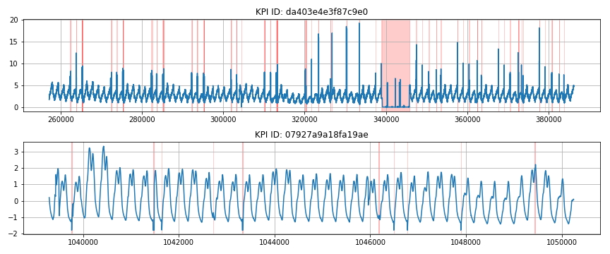

# AIOps Benchmark (Real World)
## Dataset
- https://github.com/NetManAIOps/AIOps-Challenge-2020-Data
- https://competition.aiops-challenge.com/home/competition/1484452272200032281

## Information
- Ground Truth 라벨이 있는 인터넷 회사(Alibaba, Sogou, Tencent, Baidu, and eBay)의 여러 실제 시나리오에서 얻은 29가지의 KPI(핵심 성능 지수) 시계열 데이터로 구성됨(http://iops.ai/competition_detail/?competition_id=5).

- 시계열 데이터는 1분 또는 5분 주기로 수집되어 있으며 Train과 Test 데이터가 구분되어 있음.
  
- KPI는 크게 `서비스 KPI`와 `시스템 KPI`의 두 가지 범주로 나뉨: 
  - `서비스 KPI`는 페이지 응답 시간, 페이지 보기 및 연결 오류 수와 같은 웹 서비스의 크기와 품질을 반영하는 성능 메트릭
  - `머신 KPI`는 CPU 사용률, 메모리 사용률, 디스크 IO, 네트워크 카드 처리량 등과 같은 머신(서버, 라우터, 스위치)의 상태를 반영하는 성능 메트릭

*Figure: Trends of two distinct KPIs with highlighted anomalies*
