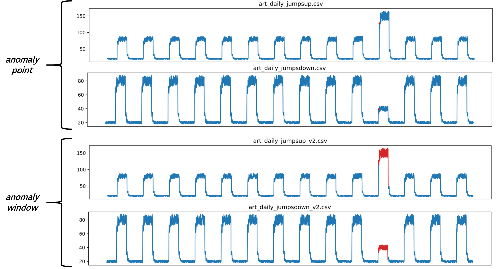
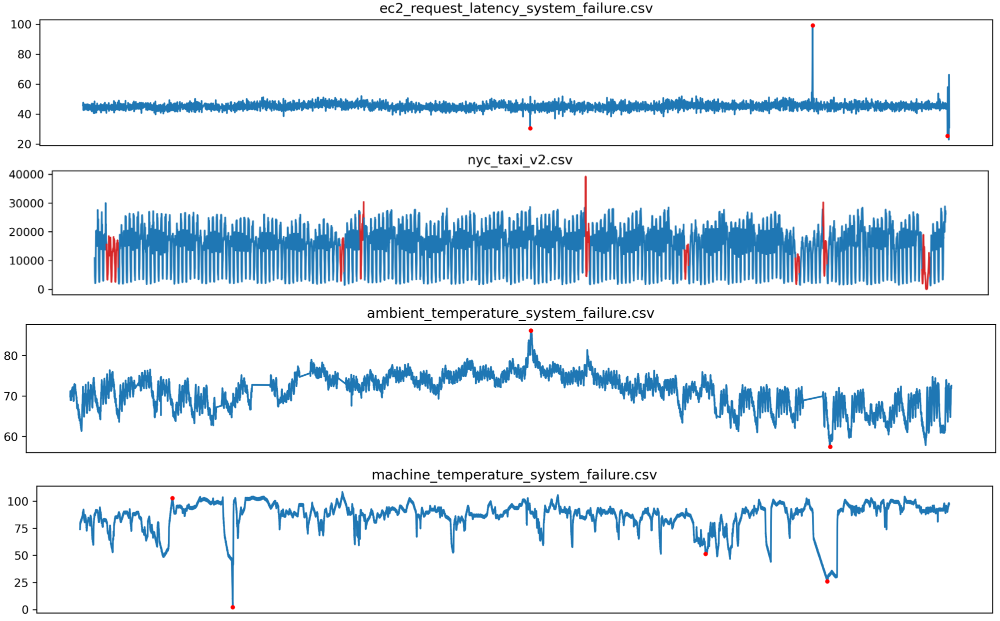
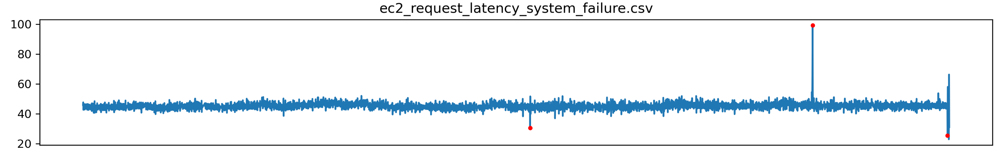
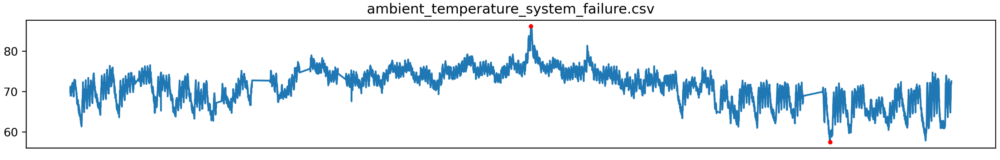
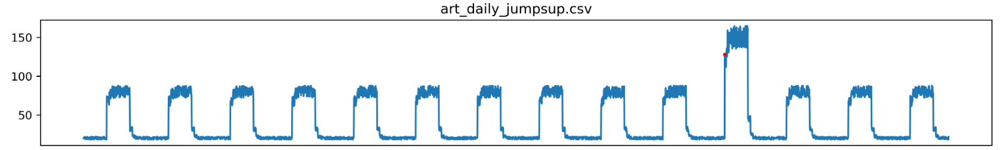
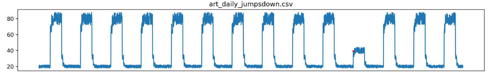

# NAB Benchmark (Real World)
## Github & Paper
- https://github.com/numenta/NAB
- https://arxiv.org/ftp/arxiv/papers/1510/1510.03336.pdf

## Paper Summary
- 실제 스트리밍 분석은 온라인에서 실행되는 새로운 알고리즘과 그에 상응하는 평가 도구를 요구함
- 계층적 시간 메모리(HTM)를 사용한 이상 탐지는 최신 online, unsupervised 방법론임
- Numenta Anomaly Benchmark(NAB)는 실제 사용을 위한 이상 탐지 알고리듬을 평가하기 위해 설계됨

*Figure: Artifical Numenta Anomaly Benchmark(NAB) Dataset Example*

*Figure: Real World Numenta Anomaly Benchmark(NAB) Dataset Example*

## Data & Labels
### Data Summary
#### Real data
- realAWSCloudwatch/~
    AWS server metrics as collected by the AmazonCloudwatch service. Example metrics include CPU Utilization, Network Bytes In, and Disk Read Bytes.

- realAdExchange/~
    Online advertisement clicking rates, where the metrics are cost-per-click (CPC) and cost per thousand impressions (CPM). One of the files is normal, without anomalies.
    
- realKnownCause/~
    - ambient_temperature_system_failure.csv: The ambient temperature in an office setting
    - cpu_utilization_asg_misconfiguration.csv: From Amazon Web Services (AWS) monitoring CPU usage
    - ec2_request_latency_system_failure.csv: CPU usage data from a server in Amazon's East Coast datacenter
    - machine_temperature_system_failure.csv: Temperature sensor data of an internal component of a large, industrial mahcine
    - nyc_taxi.csv: Number of NYC taxi passengers, where the five anomalies occur during the NYC marathon, Thanksgiving, Christmas, New Years day, and a snow storm
    - rogue_agent_key_hold.csv: Timing the key holds for several users of a computer, where the anomalies represent a change in the user
    - rogue_agent_key_updown.csv: Timing the key strokes for several users of a computer, where the anomalies represent a change in the user
    
- realTraffic/~
    Real time traffic data from the Twin Cities Metro area in Minnesota

- realTweets/~
    A collection of Twitter mentions of large publicly-traded companies such as Google and IBM
    
#### Artificial data
- artificialNoAnomaly/~
    Artificially-generated data without any anomalies

- artificialWithAnomaly/~
    Artificially-generated data with varying types of anomalies

### 최종 사용 선정 데이터
- realKnownCause/ec2_request_latency_system_failure.csv -> PAD

*Figure: ec2_request_latency_system_failure.csv visualization*

- realKnownCause/ambient_temperature_system_failure.csv -> PAD

*Figure: ambient_temperature_system_failure.csv visualization*

- artificialWithAnomaly/art_daily_jumpsup.csv -> CAD

*Figure: art_daily_jumpsup.csv visualization*

- artificialWithAnomaly/art_daily_jumpsdown.csv -> CAD

*Figure: art_daily_jumpsdown.csv visualization*

### 선정 근거
- `Visualization metric` -> 정성평가를 기준으로 PAD기반 데이터 선정
- 가장 직관적인 PAD/CAD 데이터를 기반으로 기초 분석 수행

### Label Used
- Point Anomaly : https://github.com/numenta/NAB/blob/5a98e4f15e4508b2d1472ac31db2467dd87a9a28/labels/combined_labels.json
- Windown Anomaly : https://github.com/numenta/NAB/blob/5a98e4f15e4508b2d1472ac31db2467dd87a9a28/labels/combined_windows.json