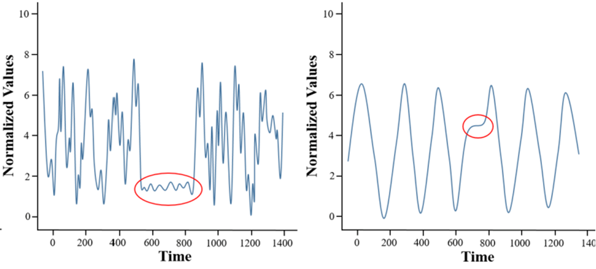
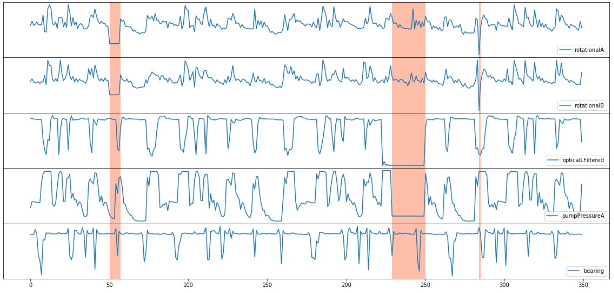

# NeurlPS-TS (synthetic)
## Dataset
- https://github.com/datamllab/tods/tree/benchmark/benchmark/synthetic/

## Information
- Synthetic data 가공 가능한 연구용 Benchmark Dataset으로 다양한 모드 지원 (MAD, PAD, CAD)

## Experiment Settings
- 동일한 환경 setting으로 각각 PAD/CAD/MAD에설정에 적합하도록 synthetic dataset를 생성하여 모델 평가 수행
    - PAD : Point Anomaly Detection → "Out - of - Range" Point Anomaly
    

    *Figure: Example of Point Anomaly Detection*
        
    - CAD : Contextual Anomaly Detection → "Contextual" Collective Anomaly
    

    *Figure: Example of Contextual Anomaly Detection*
    
    - MAD : Multivariate Anomaly Detection → "Multivariate" Point + Collective Anomaly
    

    *Figure: Example of Multivariate Anomaly Detection*